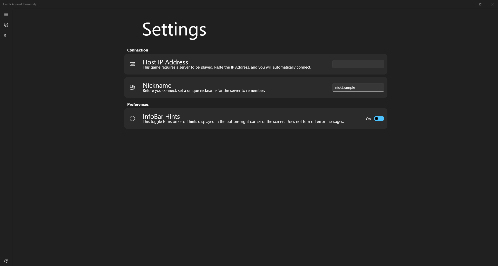
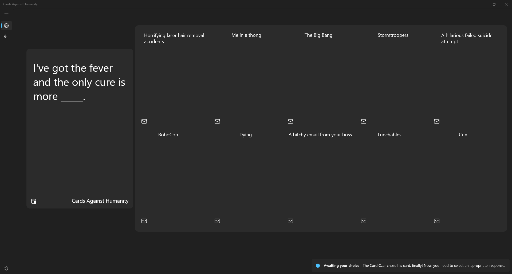
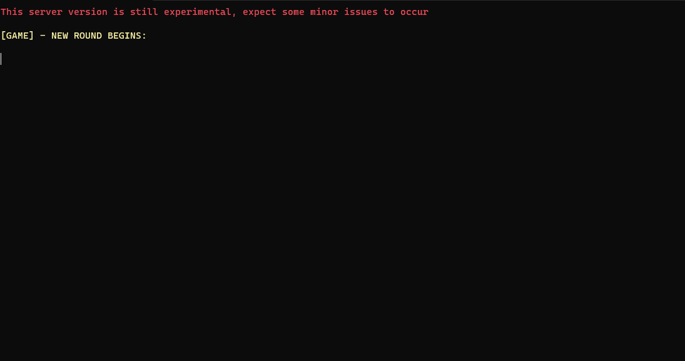

# Cards Against Humanity

Cards Against Humanity is a social game based-on a [card game with the same title](https://www.cardsagainsthumanity.com/). 

## Information about the project:

### Copyright:

I do not own any rights to the card game. It is just a free-time project i've been working on for a while. The game is not that advanced. Wanted to post it on github, it's a great way to start learning UWP.

### The client:

Written in C# UWP using the [WinUI 2.8.2 Framework](https://microsoft.github.io/microsoft-ui-xaml/). The client also uses the [Microsoft UWP Toolkit](https://www.nuget.org/packages/Microsoft.Toolkit.Uwp/) and the [WatsonTCP](https://github.com/jchristn/WatsonTcp) for the TCP/IP connection.

### The server:

Written in .NET C# as a simple Console Application. It also uses the [WatsonTCP](https://github.com/jchristn/WatsonTcp) API.

## Game rules:

The best place to read the rules is either the [Cards Against Humanity Website](https://www.cardsagainsthumanity.com/) or the [official pdf rulebook](https://cdn.sanity.io/files/vc07edlh/production/024751665e12163130085836650f4f7387e2de0a.pdf). Rules of the original are mostly the same. The only difference is that in the card game only the Card Czar can choose the best answer. In my adaptation eveyrone can vote who they think answered the best.

### Game roles:

There are two types of players you can become:

- **The Card Czar**: Your job is to choose a card everyone has to answer.
- **Normal player**: Your job is to answer the Card Czars' card.

### How does the round playout:

1. Firstly, after everyone joins the server and the host starts the game, one of the players will be chosen as the Card Czar. Everyone has to wait until he chooses a card.
2. Next, every normal player will be given 10 random cards. They need to select the best answer.
3. After everyone has finally selected a card, everyone (including the Card Czar) needs to decide whose answer they like the most.
4. Lastly, the most-voted card will be revealed.

## How does it work:

The game works relatively simple. There is a variable called **gameState**, which helps the game understand what it has to do. Values for **gameState** are different for the server and the client.

### The server:

1. **gameState = 0** - Awaiting for clients. In this phase, the server waits for people to connect.
2. **gameState = 1** - Selecting the Card Czar. In this stage, the server selects a random player to become the Card Czar. Next, server sends a message to every client, sending player nicknames and telling them who is the Card Czar.
4. **gameState = 2** - Awaiting black cards. Waiting for the fill-in or question cards. After receiving it, the server sends it to everyone else.
3. **gameState = 3** - Awaiting white cards (answer cards) from clients. The server waits for every normal player (not counting the Card Czar) to share the chosen white card. After everyone shared their white card, the server sends the list of white cards (and whose card it is) to everyone.
4. **gameState = 4** - Awaiting votes from clients. The server waits for everyone (including the Card Czar) to send a message telling which card they voted for. Afterwards, it sends this information to everyone else.

### The client:

1. **gameState = 0** - Awaiting server connection.
2. **gameState = 1** - Checking if the player is the Card Czar. If the player is the Card Czar, generate 5 random cards for him to chose one of them. If he is not the Card Czar, await his turn.
3. **gameState = 2** - Awaiting Card Czars' choice. Waiting for the headPlayer to choose one of the 5 cards. When he does, send information to the server.
4. **gamestate - 3** - Awaiting results. In this stage, players will wait for everyone to finish choosing their cards. Clients await information from the server during this gameState.
5. **gameState = 4** - Awaiting ID and Type of the black card. In this stage, everyone (apart from the Card Czar) will wait until the Card Czar chooses his card.
6. **gameState = 5** - Waiting for the players choice. In this stage, the client awaits input from the player. They need to choose a white card. Afterwards, their card will be sent to the server.
7. **gameState = 6** - Waiting for the round restart command. The client waits for the server to send a round restart request.
8. **gameState = 7** - Voting for the best cards. In this stage, the client awaits for the players input. Everyone (including the Card Czar) will have to choose a single card.
9. **gameState = 8** - Waiting for everyones vote. Waiting for the servers message, which will be sent out after everyone finishes voting.
